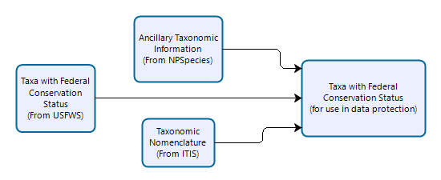

# Overview

Data Release Reports (DRRs) are created by the National Park Service and provide detailed descriptions of valuable research datasets, including the methods used to collect the data and technical analyses supporting the quality of the measurements. Data Release Reports focus on helping others reuse data, rather than presenting results, testing hypotheses, or presenting new interpretations, methods or in-depth analyses. 

DRRs are intended to document the processing of fully-QAed data to their final (QCed) form in a reproducible and transparent manner. DRRs document the data collection methods and quality standards used to prepare and review data prior to release. DRRs present the quality of resultant data in the context of fitness for their intended use. 

Each DRR cites source and resultant datasets that are published concurrently and cross-referenced. Associated datasets are made publicly available with the exception of data that must be protected from release as per NPS and park-specific policies.

Data packages that are published concurrently with DRRs are intended to be independently citable scientific works that can serve as the basis for subsequent analysis and reporting by NPS or third parties.

# Project Set-up
New projects can be established using this template by downloading a [zip file](https://github.com/nationalparkservice/DRR_Template/zipball/master) of the Template and associated files and folders.

## Folder Structure
General directory contents are as follows (Figure 1):
<div class="figure" style="text-align: center">

<p class="caption">**Figure 1.** Standard project directory structure for data release reports.</p>
</div>

- `input` This is the only location (other than the template script itself) where you you should manually change or edit files. This is where data files you need to supply should be placed.  
  
  - `figures`  If you have figures that are not generated as part of running this template, place those files here.

- `output` Do not edit these files. This is where you can find your final products. Edits to files in this folder will not be incorporated when you knit the DRR_to_docx.rmd file. Any edits you make to files in this directory may be overwritten when you knit the template. 

- `temp` Do not edit these files. These are files that are either used or generated during when you knit the DRR_to_docx.rmd template. They may include graphics, text, or data.

# Creating a Reproducible Report

The following is for users who are using the `DRR_to_docx.rmd` template file to generate a data release report using RMarkdown. 

## Standard Code Chunks
In addition to the report outline and a description of content for each section, the template includes four standard code chunks.

**YAML Header:**

The YAML header helps format the DRR. You should not need to edit any of the YAML header.

**R code chunks:**

- `user_edited_parameters`. A series of parameters that are used in the creation of the DRR and may be re-used in metadata and associated data package construction. You will need to edit these parameters for each DRR.
  - `title`. The title of the Data Release Report.
  - `reportNumber`. This is optional, and should _only_ be included if publishing in the semi-official DRR series. Set to NULL if there is no reportNumber.
  - `DRR_DSRefID`. This is the DataStore reference ID for the report.
  - `authorNames`. A list of the author's names.
  - `authorAffiliations`. A list of the author's affiliations. The order of author affiliations must match the order of the authors in the `authorNames` list. Note that the entirety of each affiliation is enclosed in a single set of quotations. Line breaks are indicated with the <br> tag. Do not worry about indentation or word wrapping. If two authors have the same affiliation, list the affiliation twice.
  - `authorORCID`. A list of ORCID iDs for each author in the format "xxxx-xxxx-xxxx-xxxx". If an author does not have an ORCID iD, specify NA (no quotes). The order of ORCID iDs (and NAs) must correspond to the order of authors in the `authorNames` list. Future iterations of the DRR Template will pull ORCID iDs from metadata and eventually from Active Directory. See [ORCID](https://www.orcid.org/) for more information about ORCID iDs or to register an ORCID iD.
  - `DRRabstract`. The abstract for the DRR (which may be distinct from the data package abstract). Pay careful attention to non-standard characters, line breaks, carriage returns, and curly-quotes. You may find it useful to write the abstract in NotePad or some other text editor and NOT a word processor (such as Microsoft Word). Indicate line breaks with \n and a space between paragraphs - should you want them - using \n\n. The Abstract should succinctly describe the study, the assay(s) performed, the resulting data, and their reuse potential, but should not make any claims regarding new scientific findings. No references are allowed in this section. A good suggested length for abstracts is less than 250 words.
  - `dataPackageRefID`. DataStore reference ID for the data package associated with this report. You must have at least one data package. Eventually, we will automate importing much of this information from metadata and include the ability to describe multiple data packages in a single DRR.
  - `dataPackageTitle`. The title of the data package. Must match the title on DataStore (and metadata).
  - `dataPackageDescription`. A short title/subtitle or short description for the data package. Must match the data package metadata.
  - `dataPackageDOI`. Auto-generated, no need to edit or update. This is the data package DOI. It is based on the DataStore reference number.
  - `dataPackage_fileNames`. List the file names in your data package. Do NOT include metadata files. For example, include "my_data.csv" but do NOT include "my_metadata.xml".
  -  `dataPackage_fileSizes`. List the approximate size of each data file. Make sure the order of the file sizes corresponds to the order of file names in `dataPackage_fileNames`.
  `dataPackage_fileDescript`. A short description of the corresponding data file that helps distinguish it from other data files. A good guideline is 10 words or less. This will be used in a table summary table so brevity is a priority. If you have already created metadata for your data package in EML format, this should be the same text as found in the "entityDescription" element for each data file.

- `setup`. Most users will not need to edit this code chunk. There is one code snippet for loading packages; the `RRpackages` section is a suite of packages that are used to assist with reproducible reporting. You may not need these for your report, but we have included them as part of the base recommended packages. If you plan to perform you QC as part of the DRR construction process, you can add a second code snipped to import necessary packages for your QC process here.

- `title_do_not_edit`. These parameters are auto-generated based on either the EML you supplied (when that becomes an option) or the information you've already supplied under "user-edited-parameters". You really should not need to edit these parameters. 

- `authors_do_not_edit`. There is no need to edit this chunk. This writes the author names, ORCID iDs, and affiliations to the .docx document based on information supplied in user-edited-parameters. 

- `LoadData`. Any datasets you need to load can go here. For most people these datasets are used to generate summary statistics on proportions of data that were flagged as accepted (A) accepted, estimated (AE) and rejected (R) during the quality control process. 

- `FileTable`. Do not edit. Generates a table of file names, sizes,  and descriptions in the data package being described by the DRR.

- `dataFlaggingTable`. This sample code provides a summary table defining the suggested data flagging codes. There is no need to edit this table.

- `Listing`. Appendix A, by default is the code listing. This will generate all code used in generating the report and data packages. In most cases, code listing is not required. If all QA/QC processes and data manipulations were performed elsewhere, you should cite that code (in the methods and references) and leave the "listing code chunk with the default settings of eval=FALSE and echo=FALSE. If you have developed custom scripts, you can add those to DataStore with the reference "Script" and cite them in the DRR. 

- `session-info` is the information about the versions of R and packages used in generating the report. In most cases, you do not need to report session info (leave the session-info code chunk parameters in their default state: eval=FALSE). Session and version information is only necessary if you have set the "Listing" code chunk in appendix A to eval=TRUE. In that case, change the "session info" code chunk parameters to eval=TRUE.

## Text 

The following text in the body of the DRR template will need to be edited to customize it to each data package:

### Data Records
This is a required section and consists of two subheadings:

  * **Data inputs** - an optional subsection used to describe datasets that the data package is based on if it is a re-analysis, reorganization, or re-integration of prevously existing data sets.
  
  * **Summary of datasts created ** - this is a required section used to explain each data record associated with the work (for instance, a data package), including the DOI indicating where this information is stored. It shoudl also provide an overview of the data files and their formats. Each external data record should be cited.

Sample text is included that uses r code to incorporate previously specified parameters such as the data package title, file names, and DOI.

A code for a sample table summarizing the contents of the data package (except the metadata) is provided.

### Data Qualit and Evaluation

This is a required section. and the text includes multiple suggested text elements and code for an example table defining data flagging codes. Near future development here will incorporate additional optional tables to summarize the data quality based on the flags in the data sets.

### Usage Notes

This is a required section that should contain brief instructions to assist other researchers with reuse of the data. This may include discussion of software packages (with appropriate citations) that are suitable for analysing the assay data files, suggested downstream processing steps (e.g. normalization, etc.), or tips for integrating or comparing the data records with other datasets. Authors are encouraged to provide code, programs or data-processing workflows if they may help others understand or use the data.

### Methods
This is a required section that cites previous methods used but should also be detailed enough in describing data production including the experimental design, data acquisition assays, and any computational processing (e.g. normalization, QA, QC) such that others can understand the methods without referring to associated publications.  

Optional sub-sections within the methods include:

  * **Data Collection and Sampling**
  * **Additional Data Sources**
  * **Data Processing**
  * **Code availability**

### References

This required section includes full bibliographic references for each paper, chapter, book, data package, dataset, protocol, etc cited within the DRR. 

There are numerous examples of proper formatting for each of these. Future versions of the DRR will enable automatic reference formatting given a correctly formatted bibtex file with the references (.bib).

## Figures
Figures should be inserted using code chunks in all cases so that figure
settings can be set in the chunk header. The chunk header should at a minimum
set the fig.align parameter to “center” and the specify the figure caption
(fig.cap parameter). Inserting figures this way will ensure that the caption is
properly formatted and it will apply copy the caption to the figure’s “alt text”
tag, making it 508-compliant.

For example:

````markdown
```{r figure1, echo=FALSE, fig.align="center", out.width="70%", fig.cap="**Figure 2.** Example general workflow to include in the methods section."}

```
````

Results in:

<div class="figure" style="text-align: center">

<p class="caption">**Figure 2.** Example general workflow to include in the methods section.</p>
</div>

## Tables
Tables should be created using the kable function. Specifying the caption in the
kable function call (as opposed to inline markdown text) will ensure that the
caption is appropriately formatted.

For example:

````markdown
```{r Table2, echo=FALSE}
c1<-c("Protocol1","Protocol2","Protocol3")
c2<-c("Park Unit 1","Park Unit 2","Park Unit 3")
c3<-c("Site 1","Site 2","Site 3")
c4<-c("Date 1","Date 2","Date 3")
c5<-c("GEOXXXXX","GEOXXXXX","GEOXXXXX")
Table2<-data.frame(c1,c2,c3,c4,c5)

kable(Table2, 
      col.names=c("Subjects","Park Units","Locations","Sampling Dates","Data"),
      caption="**Table 1.** Monitoring study example Data Records table.") %>%
  kable_styling(bootstrap_options = c("striped", "hover", "condensed", "responsive"),full_width=F)
```
````
Results in:

<table class="table table-striped table-hover table-condensed table-responsive" style="width: auto !important; margin-left: auto; margin-right: auto;">
<caption>**Table 1.** Monitoring study example Data Records table.</caption>
 <thead>
  <tr>
   <th style="text-align:left;"> Subjects </th>
   <th style="text-align:left;"> Park Units </th>
   <th style="text-align:left;"> Locations </th>
   <th style="text-align:left;"> Sampling Dates </th>
   <th style="text-align:left;"> Data </th>
  </tr>
 </thead>
<tbody>
  <tr>
   <td style="text-align:left;"> Protocol1 </td>
   <td style="text-align:left;"> Park Unit 1 </td>
   <td style="text-align:left;"> Site 1 </td>
   <td style="text-align:left;"> Date 1 </td>
   <td style="text-align:left;"> GEOXXXXX </td>
  </tr>
  <tr>
   <td style="text-align:left;"> Protocol2 </td>
   <td style="text-align:left;"> Park Unit 2 </td>
   <td style="text-align:left;"> Site 2 </td>
   <td style="text-align:left;"> Date 2 </td>
   <td style="text-align:left;"> GEOXXXXX </td>
  </tr>
  <tr>
   <td style="text-align:left;"> Protocol3 </td>
   <td style="text-align:left;"> Park Unit 3 </td>
   <td style="text-align:left;"> Site 3 </td>
   <td style="text-align:left;"> Date 3 </td>
   <td style="text-align:left;"> GEOXXXXX </td>
  </tr>
</tbody>
</table>

# Publishing Data Release Reports and Associated Data

## Acquiring Report Numbers
Because data release reports and associated data packages are cross-referential, report
numbers are typically assigned early in data processing and quality evaluation. 

- **DataStore Reference Numbers.** When developing a report and data packages, DataStore references should be created as early in the process as practicable. While the report and data packages are in development, these should not be activated. 

- **Report Numbers.** If you are planning to publish a data release report with an official DRR number, please contact the IMD Deputy Chief with the DataStore reference number associated with the DRR.  

- **Persistent Identifiers.** Digital object identifiers (DOIs) will be assigned to all DRRs and concurrently-published data packages. DOIs will resolve to a DataStore Reference; DOIs are reserved when a draft reference is initiated in DataStore.

DRR DOIs have the format: https://doi.org/10.36967/xxxxxxx

Data package DOIs have the format:
https://doi.org/10.57830/xxxxxxx

Where the "xxxxxx" is the 7-digit DataStore reference number. 

## Liability Statements ##
Under no circumstances should reports and associated data packages or metadata published in the DRR series contain disclaimers or text that suggests that the work does not meet scientific integrity or information quality standards of the National Park Service. The following disclaimers are suitable for use, depending on whether the data are provisional or final (or approved or certified).

> **For approved & published data sets:** "Unless otherwise stated, all data, metadata and related materials are considered to satisfy the quality standards relative to the purpose for which the data were collected. Although these data and associated metadata have been reviewed for accuracy and completeness and approved for release by the National Park Service Inventory and Monitoring Division, no warranty expressed or implied is made regarding the display or utility of the data for other purposes, nor on all computer systems, nor shall the act of distribution constitute any such warranty." 

> **For provisional data:** "The data you have secured from the National Park Service (NPS) database identified as [database name] have not received approval for release by the NPS Inventory and Monitoring Division, and as such are provisional and subject to revision. The data are released on the condition that neither the NPS nor the U.S. Government shall be held liable for any damages resulting from its authorized or unauthorized use."
