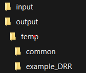

```{r setup, include=FALSE}
RRpackages <- c('markdown',     # links to Sundown rendering library
                'rmarkdown',    # newer rendering via pandoc
                'pander',       # alternative renderer for markdown,
                                # plus better tables than just knitr
                'knitr',
                "devtools",
                "R.rsp",        # dynamic generation of scientific reports
                "rmdHelpers",   # misc from Mark Peterson
                                #  thisFileName() thisFile_knit()
                'yaml',         # format data into markdown
                'kableExtra',
                'rmdformats',   # templates including automatic ToC,
                                # also use_bookdown()
                'htmltools'     #
                )

inst <- RRpackages %in% installed.packages()
if (length(RRpackages[!inst]) > 0) {
   install.packages(RRpackages[!inst], repos = "http://cran.us.r-project.org", dep = TRUE)
}
lapply(RRpackages, library, character.only = TRUE)

knitr::opts_chunk$set(
   echo = TRUE,
   comment = " ",
   dev = "svg",
   tidy.opts = list(width.cutoff = 60),
   tidy = TRUE
   )

```

# Overview
Data Release Reports (DRRs) are created by the National Park Service and provide detailed descriptions of valuable research datasets, including the methods used to collect the data and technical analyses supporting the quality of the measurements. Data Release Reports focus on helping others reuse data, rather than presenting results, testing hypotheses, or presenting new interpretations, methods or in-depth analyses. 

DRRs are intended to document the processing of fully-QAed data to their final (QCed) form in a reproducible and transparent manner. DRRs document the data collection methods, quality standards, and processing code used to prepare and review data prior to release, and present the quality of resultant data in the context of fitness for their intended use. 

Each DRR cites source and resultant datasets that are published concurrently and cross-referenced. Associated datasets are made publicly available with the exception of data that must be protected from release as per NPS and park-specific policies.

Data packages that are published concurrently with DRRs are intended to be independently citable scientific works that can serve as the basis for subsequent analysis and reporting by NPS or third parties.

# Project Set-up
New projects can be established using this template by downloading a zip file of the package from [Dev Purposes TEMP Link](https://RobLBaker/IMD_DRR_Templat/zipball/master).

## Folder Structure
General directory contents are as follows (Figure 1):
```{r figure1, echo=FALSE, fig.align="center", out.width="30%",  fig.cap="**Figure 1.** Standard project directory structure for data release reports."}


```

- `input` This is the only location where you you should manually change or edit files. This is where data files you need to supply should be placed. 
  
  - `figures`  If you have figures that are not generated as part of running this template, place those files here.

- `output` Do not edit these files. This is where you can find your final products. Edits to files in this folder will not be incorporated when you knit the DRR_Template. Any edits you make to files in this directory may be overwritten when you knit the template. 

- `temp` Do not edit these files. These are files that are either used or generated during when you knit the DRR_Template. They may include graphics, text, or data.

  - `common` houses files that are shared across all projects and generally should not be edited by the user. Notable files:

    - `header.html` includes all of the graphic identity material at the top of the rendered report.
    - `footer.html` includes all of the "about this report" information similar to what is found in the front matter of reports published in the NRR and NRDS series.
    - `journalnps.min.css` includes stylesheet tweaks that modify the standard markdown "journal" theme to approxmiate NPS graphic identity standards.
    - `DRR Word Template.docx` is intended for users who prefer to author reports in Microsoft Word and then convert to markdown (as opposed to authoring reports in rmarkdown). Instructions on how to use this method of DRR report creation are below.
  
# Creating a Reproducible Report
The following is for users who are using the `DRR_Template.RMD` template file to generate a data release report using RMarkdown. If you are planning to author your report in MS Word, please see Appendix A below.

## Standard Code Chunks
In addition to the report outline and a description of content for each section, the template includes four standard code chunks.

**YAML Header:**

The YAML header helps format the DRR. You should not need to edit any of the YAML header.

**R code chunks:**

- `user_edited_parameters`. A series of parameters that are used in the creation of the DRR and may be re-used in metadata and associated data package construction. You will need to edit these parameters for each DRR.
  - `title`. The title of the Data Release Report.This will be converted to all upper case. 
  - `reportNumber`. This is optional, and should _only_ be included if publishing in the semi-official DRR series. 
  - `DRR_DSRefID`. This is the Data Store reference ID for the report.
  - `AuthorNumb`. The number of authors for the DRR. There must be a minimum of 1 author!
  - `AuthorName1`. The name of the first author.
  - `AuthorAffiliation1`. The affiliation/address of the first author.
  - `AuthorName2`. Optional based on number of authors. If one author, comment out using #
  - `AuthorORCID1` Optional 16-digit ORCID iD. If you have an ORCID iD enter it here in quotes, with dashes separating every 4 digits as in the example. If not, enter NA (no quotes). Specifying an ORCID iD will add a green ORCID icon after the author's name with a link to the corresponding ORCID author profile. Future iterations of the DRR Template will pull ORCID iDs from metadata and eventually from Active Directory. See [ORCID](https://www.orcid.org/) for more information about ORCID iDs.
  - `AuthorAffiliation2`. Optional based on number of authors. If one author, comment out using #. Add additional AuthorName# and AuthorAffiliation# as needed, following the template.
  - `DRRabstract`. The abstract for the DRR (which is distinct from the data package abstract). Pay careful attention to non-standard characters, line breaks, carriage returns, and curly-quotes. You may find it useful to write the abstract in NotePad or some other text editor and NOT a word processor (such as Microsoft Word). Indicate line breaks with \n and a space between paragraphs - should you want them - using \n\n. The Abstract should succinctly describe the study, the assay(s) performed, the resulting data, and their reuse potential, but should not make any claims regarding new scientific findings. No references are allowed in this section. A good suggested length for abstracts is less than 250 words.
  - `dataPackage1RefID`. DataStore reference ID for the data package associated with this report. You must have at least one data package.Eventually, we will automate importing much of this information from metadata and include the ability to describe multiple data packages in a single DRR.
  - `dataPackage1Title`. The title of the data package. Must match the title on DataStore (and metadata).
  - `dataPackage1Description`. A short title/subtitle or short description for the data package. Must match the data package metadata.
  - `dataPackage1DOI`. Auto-generated, no need to edit or update. This is the data package DOI. It is based on the DataStore reference number.
  - `dataPackage1_filenumb`. The number of data files in the data package described by the DRR. Exclude metadata files! For in this example the data package includes 3 files at upload: one metadata file and two data files.
  - `dataPackage1_datafile1_name`. The file name for the first data file in the data package. Each data package must include at least one data file.For example, "my_data.csv".
  - `dataPackage1_datafile1_descript`. A short description of the corresponding data file that helps distinguish it from other data files. A good guideline is 10 words or less.
  - `dataPackage1_datafile2_name`. The file name for the second data file. For example, "my_data2.csv".
  - `dataPackage1_datafile2_descript`.  A short description of the corresponding data file that distinguishes it from other data files. A good guideline is 10 words or less.You can add additional data files and descriptions using the same format.
  
- `setup`. Pretty self explanatory, but there are two snippets for loading packages; the `RRpackages` section is a suite of packages that are used to assist with reproducible reporting. You may not need these for your report, but we have included them as part of the base recommended packages. There is a second snippet for `pkgList` that includes all project-specific packages needed. Add as necessary.

- `title_do_not_edit`. These parameters are auto-generated based on either the EML you supplied (when that becomes an option) or the information you've already supplied under "user-edited-parameters". You really should not need to edit these parameters. 

- `authors_do_not_edit`. There is no need to edit this chunk. This writes the author names, ORCID iDs, and affiliations to the html document based on information supplied in user-edited-parameters. 

- `LoadData`. Any datasets you need to load can go here.

- `datapackage_files`. Do not edit. Generates a list of file names and descriptions in the data package being described by the DRR.

- `Listing`. Appendix A, by default is the code listing. This will generate all code used in generating the report and data packages.

- `session-info` is the information about the versions of R and packages used in generating the report.


## Figures
Figures should be inserted using code chunks in all cases so that figure
settings can be set in the chunk header. The chunk header should at a minimum
set the fig.align parameter to “center” and the specify the figure caption
(fig.cap parameter). Inserting figures this way will ensure that the caption is
properly formatted and it will apply copy the caption to the figure’s “alt text”
tag, making it 508-compliant.

For example:

````markdown
`r ''````{r figure1, echo=FALSE, fig.align="center", out.width="70%", fig.cap="**Figure 2.** Example general workflow to include in the methods section."}
include_graphics("ProcessingWorkflow.png")
```
````

Results in:

```{r figure2, echo=FALSE, fig.align="center", out.width="70%", fig.cap="**Figure 2.** Example general workflow to include in the methods section."}
include_graphics("ProcessingWorkflow.png")

```

## Tables
Tables should be created using the kable function, with additional formatting
options available via the kableExtra package. Specifying the caption in the
kable function call (as opposed to inline markdown text) will ensure that the
caption is appropriately formatted using the theme stylesheet. The table format
has been designed to mimic the NPS graphic identity standards.

In general, tables should be created with the bootstrap_options of striped,
hover, condensed, and responsive, with full_width set to false.

For example:

````markdown
`r ''````{r Table1, echo=FALSE}
c1<-c("Mouse1","Mouse2","Mousen")
c2<-c("Drug treatment","Drug treatment","Drug treatment")
c3<-c("Liver dissection","Liver dissection","Liver dissection")
c4<-c("RNA extraction","RNA extraction","RNA extraction")
c5<-c("RNA-Seq","RNA-Seq","RNA-Seq")
c6<-c("GEOXXXXX","GEOXXXXX","GEOXXXXX")
Table1<-data.frame(c1,c2,c3,c4,c5,c6)

kable(Table1, 
      col.names=c("Subjects","Protocol 1","Protocol 2","Protocol 3","Protocol 4","Data"),
      caption="**Table 1.** Experimental study example Data Records table.") %>%
  kable_styling(bootstrap_options = c("striped", "hover", "condensed", "responsive"),full_width=F)
```
````
Results in:

```{r Table1, echo=FALSE}
c1<-c("Mouse1","Mouse2","Mousen")
c2<-c("Drug treatment","Drug treatment","Drug treatment")
c3<-c("Liver dissection","Liver dissection","Liver dissection")
c4<-c("RNA extraction","RNA extraction","RNA extraction")
c5<-c("RNA-Seq","RNA-Seq","RNA-Seq")
c6<-c("GEOXXXXX","GEOXXXXX","GEOXXXXX")
Table1<-data.frame(c1,c2,c3,c4,c5,c6)

kable(Table1, 
      col.names=c("Subjects","Protocol 1","Protocol 2","Protocol 3","Protocol 4","Data"),
      caption="**Table 1.** Experimental study example Data Records table.") %>%
  kable_styling(bootstrap_options = c("striped", "hover", "condensed", "responsive"),full_width=F)
```
Note that rendered tables are not fully 508 compliant, but they’re close. We are
currently working on extending (or contributing to) the kable package so that
rendered tables are 508 compliant.

# Publishing Data Release Reports and Associated Data

## Acquiring Report Numbers
Because data release reports and associated data packages are cross-referential, report
numbers are typically assigned early in data processing and quality evaluation. 

- **DataStore Reference Numbers.** When developing a report and data packages, DataStore references should be created as early in the process as practicable. While the report and data packages are in development, these should not be activated. 

- **Report Numbers.** If you are planning to publish a data release report with an official DRR number, please contact the IMD Deputy Chief with the Data Store reference number associated with the DRR.  

- **Persistent Identifiers.** Digital object identifiers (DOIs) will be assigned to all DRRs and concurrently-published data packages. DOIs will resolve to a DataStore Reference; DOIs are reserved when a draft reference is initiated in DataStore.

DRR DOIs have the format: https://doi.org/10.36967/xxxxxxx

Data package DOIs have the format:
https://doi.org/10.57830/xxxxxxx

Where the "xxxxxx" is the 7-digit DataStore reference number. 

## Liability Statements ##
Under no circumstances should reports and associated data packages or metadata published in the DRR series contain disclaimers or text that suggests that the work does not meet scientific integrity or information quality standards of the National Park Service. The following disclaimers are suitable for use, depending on whether the data are provisional or final (or approved or certified).

> **For approved & published data sets:** "Unless otherwise stated, all data, metadata and related materials are considered to satisfy the quality standards relative to the purpose for which the data were collected. Although these data and associated metadata have been reviewed for accuracy and completeness and approved for release by the National Park Service Inventory and Monitoring Division, no warranty expressed or implied is made regarding the display or utility of the data for other purposes, nor on all computer systems, nor shall the act of distribution constitute any such warranty." 

> **For provisional data:** "The data you have secured from the National Park Service (NPS) database identified as [database name] have not received approval for release by the NPS Inventory and Monitoring Division, and as such are provisional and subject to revision. The data are released on the condition that neither the NPS nor the U.S. Government shall be held liable for any damages resulting from its authorized or unauthorized use."