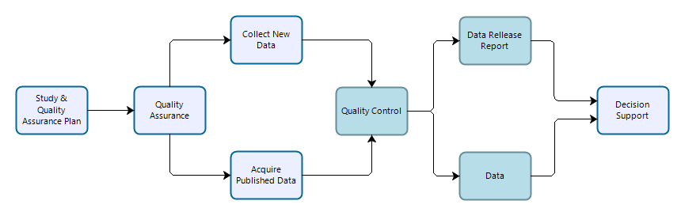

```{r setup, include=FALSE}
RRpackages <- c('markdown',     # links to Sundown rendering library
                'rmarkdown',    # newer rendering via pandoc
                'pander',       # alternative renderer for markdown,
                                # plus better tables than just knitr
                'knitr',
                "devtools",
                "R.rsp",        # dynamic generation of scientific reports
                "rmdHelpers",   # misc from Mark Peterson
                                #  thisFileName() thisFile_knit()
                'yaml',         # format data into markdown
                'kableExtra',
                'rmdformats',   # templates including automatic ToC,
                                # also use_bookdown()
                'htmltools'     #
                )

inst <- RRpackages %in% installed.packages()
if (length(RRpackages[!inst]) > 0) {
   install.packages(RRpackages[!inst], dep = TRUE)
}
lapply(RRpackages, library, character.only = TRUE)

knitr::opts_chunk$set(
   echo = TRUE,
   comment = " ",
   dev = "svg",
   tidy.opts = list(width.cutoff = 60),
   tidy = TRUE
   )

```

# Background
Recognizing the broad move toward open science, we’ve seen the following changes
in expectations (outside NPS) since the inception of the I&M program.

-   Broad adoption of open-data and open-by-default practices.

-   A move in the scientific disciplines toward considering and publishing data
    sets as independently-citable scientific works.

-   Routine assignment of digital object identifiers (DOIs) to dataset to facilitate location, reuse, and
    citation of specific data

-   Increased transparency and reproducibility in the processing and analysis of
    data.

-   Establishment of peer reviewed "data journals" dedicated to publishing data sets
    and associated documentation designed to facilitate their reuse.

-   Expectation that science-based decisions are based on peer-reviewed,
    reproducible, and open science by default.

Data release reports are designed to parallel external peer-reviewed scientific
journals dedicated to facilitate reuse of reproducible scientific data, in
recognition that the primary reason IMD data are collected is to support
science-based decisions.

Note that publication in a data release report series (not mandated) is distinct
from requirements to document data collection, processing, and quality
evaluation (mandated; see below). The establishment of a data release report
series is intended to facilitate and encourage this type of reporting in a
standard format, and in a manner commensurate with current scientific norms.

A template for creating data release reports to be published in the DRR series
and associated data packages is located at
<https://github.com/nationalparkservice/IMD_DRR_Template>. We have also
developed procedures for authoring DRR reports in Microsoft Word and porting
them to the appropriate format.  

# Definitions

**Reproducibility.** The degree to which scientific information, modeling, and
methods of analysis could be evaluated by an independent third party to arrive
at the same, or substantially similar, conclusion as the original study or
information, and that the scientific assessment can be repeated to obtain
similar results (Plesser 2017).  A study is reproducible if you can take the original data and the
computer code used to analyze the data and reproduce all of the numerical findings
from the study. This may initially sound like a trivial task but experience has shown that
it’s not always easy to achieve this seemingly minimal standard (ASA 2017, Plesser 2017).


**Transparency.** Full disclosure of the methods used to obtain, process,
analyze, and review scientific data and other information products, the
availability of the data that went into and came out of the analysis, and the
computer code used to conduct the analysis. Documenting this information is
crucial to ensure reproducibility and requires, at minimum, the sharing of
analytical data sets, relevant metadata, analytical code, and related software.

**Fitness for Use.** The utility of scientific information (in this case a
dataset) for its intended users and its intended purposes. Agencies must review
and communicate the fitness of a dataset for its intended purpose, and should
provide the public sufficient documentation about each dataset to allow data
users to determine the fitness of the data for the purpose for which third
parties may consider using it.

**Decisions.** The type of decisions that must be based on publicly-available,
reproducible, and peer-reviewed science has not been defined. At a minimum it
includes any influential decisions, but it may also include any decisions
subject to public review and comment.

**Descriptive Reporting.** The policies listed above are consistent in the
requirement to provide documentation that describes the methods used to collect,
process, and evaluate science products, including data. Note that this is
distinct from (and in practice may significantly differ from) prescriptive
documents such as protocols, procedures, and study plans. Descriptive reporting
should cite or describe relevant science planning documents, methods used,
deviations, and mitigations. In total, descriptive reporting provides a clear
“line of sight” on precisely how data were collected, processed, and evaluated.
Although deviations may warrant revisions to prescriptive documents, changes in
prescriptive documents after the fact do not meet reproducibility and
transparency requirements.

# Requirements from Policy & Guidance

## Government/NPS Reporting Requirements

**[DO11B-a](https://www.nps.gov/subjects/policy/upload/DO_11B_10-16-2002.pdf), [DO 11B-b](https://irma.nps.gov/DataStore/DownloadFile/474958), [OMB M-05-03](https://www.whitehouse.gov/wp-content/uploads/2017/11/2005-M-05-03-Issuance-of-OMBs-Final-Information-Quality-Bulletin-for-Peer-Review-December-16-2004.pdf) (Peer review and information quality):**

-   Scientific information must be appropriately reviewed prior to use in
    decision-making, regulatory processes, or dissemination to the public,
    regardless of media.

-   As per OMB M-05-03 “scientific information” includes factual inputs, data,
    models, analyses, technical information, or scientific assessments related
    to such disciplines as the behavioral and social sciences, public health and
    medical sciences, life and earth sciences, engineering, or physical
    sciences.

-   Methods for producing information will be made transparent, to the maximum
    extent practicable, through accurate documentation, use of appropriate
    review, and verification of information quality.

**[OMB M-19-15](https://www.whitehouse.gov/wp-content/uploads/2019/04/M-19-15.pdf) (Updates to Implementing the Information Quality Act):**

-   Federal agencies must collect, use, and disseminate information that is fit
    for its intended purpose.

-   Agencies must conduct pre-dissemination review of quality [of scientific
    information] based on the likely use of that information. Quality
    encompasses utility, integrity, and objectivity, defined as follows: a)
    Utility – utility for its intended users and its intended purposes, b)
    Integrity – refers to security, and c) Objectivity – accurate, reliable, and
    unbiased as a matter of presentation and substance.

-   Agencies should provide the public with sufficient documentation about each
    dataset released to allow data users to determine the fitness of the data
    for the purpose for which third parties may consider using it. Potential
    users *must* be provided with sufficient information to understand… the
    data’s strengths, weaknesses, analytical limitations, security requirements,
    and processing options.

-   Reproducibility requirements for Influential Information. Note that because
    this may not be determined at the time of collection, processing, or
    dissemination this should be the default for NPS scientific activities:

    -   Analyses must be disseminated with sufficient descriptions of data and
        methods to allow them to be reproduced by qualified third parties who
        may want to test the sensitivity of agency analyses. This is a higher
        standard than simply documenting the characteristics of the underlying
        data, which is required for all information.

    -   Computer code used to process data should be made available to the
        public for further analysis. In the context of results generated, for
        example, a statistical model or machine augmented learning and decision
        support, reproducibility requires, at a minimum transparency about the
        specific methods, design parameters, equations or algorithms,
        parameters, and assumptions used.

-   Reports, data, and computer code used, developed, or cited in the analysis
    and reporting of findings must be made publicly available except where
    prohibited by law.

## Government/NPS Guidelines on Use of Scientific Information
Multiple policy and guidance documents require the use of best available science in decision-making. Additional requirements include:

**[SO 3369](https://www.doi.gov/sites/doi.gov/files/elips/documents/so_3369_promoting_open_science.pdf) (Promoting Open Science):** 

* Defines “best available science” as publicly-available, reproducible, and peer reviewed. Requires that any decisions or scientific conclusions must prioritize the use of publicly-available, reproducible, and peer-reviewed science. Decisions or conclusions not based on such must include an explanation of why the alternative is the best available information. Effective as of 28 September 2018 with no transition period.

**[DO 11B](https://www.nps.gov/subjects/policy/upload/DO_11B_10-16-2002.pdf) (Ensuring Objectivity, Utility, and Integrity of Information Used and Disseminated by the National Park Service):** 

* The NPS will ensure that information it releases to the public or utilizes in management decisions will be developed from reliable data sources that provide the highest quality of information at each stage of information development.

## Inventory & Monitoring Program Requirements

**[NPS-75](https://irma.nps.gov/DataStore/Reference/Profile/622933) (Inventory and Monitoring Guidelines):**

-   An annual summary report documenting the condition of park resources should
    be developed as part of the annual revision of the parks Resource Management
    Plan.

-   An annual report provides a mechanism for reviewing and making
    recommendations for revisions in the [Protocol/SOPs].

-   [Inventory] data obtained should be archived in park records and, when
    appropriate, a report should be written summarizing findings.

-   Reporting requirements as per IMD directive

**[IMD Reporting and Analysis Guidance](https://irma.nps.gov/DataStore/Reference/Profile/2252934)**

-   Annual Analyses Required of all Monitoring Protocols: Conduct an annual data review
    to address whether there is any unexpected variability or outliers, and
    whether any protocol changes or additional studies may be needed. Part of
    the review must assess the data against standards defined in the protocol
    narrative, data quality standards document or quality assurance plan, and
    document whether those standards were met. When data are not available for
    review during the year they are collected (for example, when data have been
    submitted to a lab for analysis), review must be conducted the year the data
    are available. For example, if water quality and quantity data are typically
    reviewed in October and lab results for water quality are not available
    until the following March, these data must be reviewed during the following
    October review period, if not before.

# Implications for IMD Science

Because all of the data IMD collects is intended for use in supporting
science-based decisions as per our program’s five goals, and is intended for use
in planning (the decisions of which are subject to public comment as per NEPA
requirements), this means that by default:

-   All analytical work we do should be reproducible to the extent possible.
    Analytical work includes both statistical analysis and reporting of data as
    well as quality control procedures where data are tested against quality
    standards and qualified or corrected as appropriate.

-   Full reproducibility may not be possible in all cases, particularly where
    analytical methods involve subject matter expertise to make informed
    judgments on how to proceed with analyses. In such cases, decisions should
    be documented to ensure transparency.

-   All IMD data should be published with supporting documentation to allow for
    reproduction of results.

-   All IMD data should be evaluated to determine whether they are suitable for
    their intended use.

-   All IMD data should be published with information fully describing how data
    were collected, processed, and evaluated.

-   All data should be published in open formats that support the [FAIR
    principles](https://www.go-fair.org/fair-principles/) (Findable, Accessible, Interoperable, and Resuable).

# Scope (for the NPS Inventory & Monitoring Program)

**General Study data.** Any project that involves the collection of scientific
data for use in supporting decisions to be made by NPS personnel. General study
data may or may not be collected based on documented or peer-reviewed study
plans or defined quality standards, but are in most cases purpose-driven and
resultant information should be evaluated for the suitability for—and prior
to—their use in decision support. These data may be reused for secondary
purposes including similar decisions at other locations or times and/or portions
of general study data may be reused or contribute to other scientific work
(observations from a deer browsing study may be contribute to an inventory or
may be used as ancillary data to explain monitoring observations).

```{r figure1, echo=FALSE, fig.align="center", out.width="70%", fig.cap="**Figure 1.** Workflow for data collection, processing, dissemination, and use for general studies. Teal-colored boxes are subject to reproducibility requirements."}


```

**Vital Signs Monitoring data.** Vital signs monitoring data are collected by
IMD and park staff to address specific monitoring objectives following methods
designed to ensure long-term comparability of data. Procedures are established
to ensure that data quality standards are maintained in perpetuity. However,
because monitoring data are collected over long periods of time in dynamic
systems, the methods employed may differ from those prescribed in monitoring
protocols, procedures, or sampling plans, and any deviations (and resultant
mitigations to the data) must be documented. Data should be evaluated to ensure
that they meet prescribed standards and are suitable for analyses designed to
test whether monitoring objectives have been met. Monitoring data may be reused
for secondary purposes including synthesis reports and condition assessments,
and portions of monitoring data may contribute to inventories.

```{r figure2, echo=FALSE, fig.align="center", out.width="70%", fig.cap="**Figure 2.** Workflow for data collection, processing, dissemination, and use for vital sign monitoring efforts. Teal-colored boxes are subject to reproducibility requirements."}
include_graphics("WorkflowModelMonitoring.png")

```

**Inventory Study data.** Inventory study data are similar to general study data
in that they are time- and area-specific efforts designed to answer specific
management needs as well as broader inventory objectives outlined in
project-specific study plans and inventory science plans. Inventory studies
typically follow well-documented data collection methods or procedures, and
resultant data should be evaluated for whether they are suitable for use in
supporting study-specific and broader inventory-level objectives. Inventory
study data are expected to be reused to meet broader inventory level goals, but
may also support other scientific work and decision support.

```{r figure3, echo=FALSE, fig.align="center", out.width="70%", fig.cap="**Figure 3.** Workflow for data collection, processing, dissemination, and use for inventory studies. Teal-colored boxes are subject to reproducibility requirements."}
include_graphics("WorkflowModelInventories.png")

```

American Statistical Association (ASA). 2017. Recommendations to funding agencies for supporting reproducible research. https://www.amstat.org/asa/files/pdfs/POL-ReproducibleResearchRecommendations.pdf. 

Plesser, H. E. 2017. Reproducibility vs. replicability: a brief history of a confused termonology. Front Neuroinform. 11:76. https://dx.doi.org/10.3389%2Ffninf.2017.00076.

